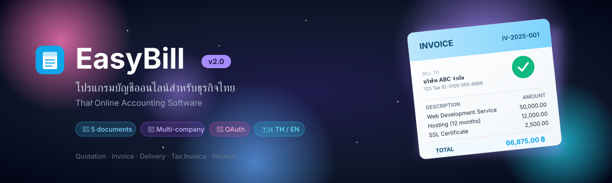
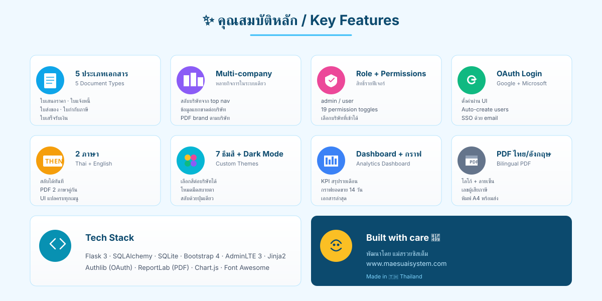
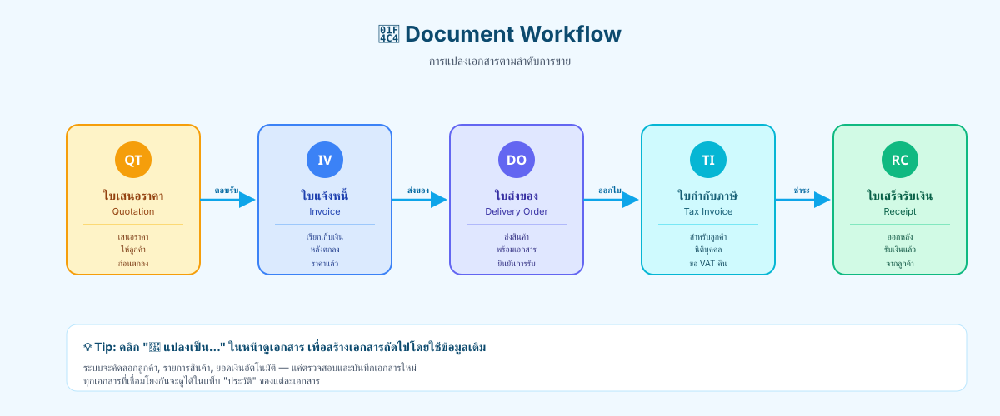

<div align="center">



# 📘 EasyBill v2.0

**โปรแกรมบัญชีออนไลน์สำหรับธุรกิจไทย**
Thai Online Accounting Software — Quotation · Invoice · Delivery · Tax Invoice · Receipt


</div>

---

## ✨ คุณสมบัติหลัก



| ฟีเจอร์ | รายละเอียด |
|---|---|
| 📄 **5 ประเภทเอกสาร** | ใบเสนอราคา (QT) · ใบแจ้งหนี้ (IV) · ใบส่งของ (DO) · ใบกำกับภาษี (TI) · ใบเสร็จรับเงิน (RC) |
| 🏢 **Multi-company** | รองรับหลายกิจการในระบบเดียว สลับได้จาก top nav · ข้อมูลแยกขาดต่อบริษัท |
| 👥 **Role + Permissions** | admin / user พร้อมตั้งสิทธิ์รายฟีเจอร์ 19 toggles |
| 🔐 **Per-user company access** | Admin กำหนดได้ว่า user เข้าบริษัทไหนได้บ้าง |
| 🌐 **OAuth Login** | Google + Microsoft (ตั้งค่าผ่าน UI ไม่ต้องแก้ env) |
| 🇹🇭 🇬🇧 **2 ภาษา** | สลับ TH/EN ได้ทันที — PDF, UI, ทุกเมนู |
| 🎨 **7 ธีมสี + Dark Mode** | เลือกสีต่อบริษัท + โหมดมืดสบายตา |
| 📊 **Dashboard** | KPI การ์ดสรุปเดือนนี้ + กราฟยอดขาย 14 วัน + เอกสารล่าสุด |
| 📤 **PDF บิลภาษี** | 2 ภาษา + โลโก้ + ลายเซ็น + เลขผู้เสียภาษี |
| ☁️ **Backup** | สำรองข้อมูลขึ้น Google Drive อัตโนมัติ |
| 📎 **ไฟล์แนบ** | แนบเอกสารประกอบในแต่ละบิลได้ |

## 📚 เอกสารและคู่มือ

| ลิงก์ | สำหรับ |
|---|---|
| 📖 [**คู่มือการใช้งานฉบับสมบูรณ์**](docs/USER_GUIDE.md) | ผู้ใช้ทั่วไป — ครอบคลุม 14 หัวข้อตั้งแต่ login ถึง backup |
| 🔄 [**Workflow แปลงเอกสาร**](docs/workflow.svg) | ลำดับการสร้างเอกสาร QT → IV → DO → TI → RC |

## 📸 ตัวอย่างหน้าจอ

### Dashboard


### Workflow เอกสาร


## 🛠️ การติดตั้ง

### ความต้องการ
- Python 3.10+
- pip
- Linux / macOS (Windows ใช้ WSL ก็ได้)

### Clone และรัน

```bash
git clone https://github.com/YOUR_USERNAME/easybill.git
cd easybill

python3 -m venv venv
source venv/bin/activate

pip install -r requirements.txt

python run.py
```

เปิดเบราว์เซอร์ที่ http://localhost:5000

### Deploy แบบ production (systemd + nginx)

```bash
sudo bash scripts/upgrade.sh
sudo systemctl restart thaibill
```

## ⚙️ ค่าเริ่มต้น

| รายการ | ค่า |
|---|---|
| Username | `admin` |
| Password | `admin1234` |
| Database | `instance/thaibill.db` (SQLite) |
| Port | `5000` (dev) / `8000` (prod) |

> ⚠️ **เปลี่ยนรหัสผ่านทันทีหลัง login ครั้งแรก** ที่ `/settings/` → แท็บผู้ใช้

## 🔧 Configuration

ตั้งค่าผ่าน UI ทั้งหมด — ไม่ต้องแก้ไฟล์ config

| หน้า | สำหรับ |
|---|---|
| `/settings/` | ข้อมูลบริษัท · โลโก้ · ลายเซ็น · ธีม |
| `/settings/oauth` | เปิด/ปิด Google + Microsoft Login |
| `/settings/companies/new` | เพิ่มกิจการใหม่ |
| `/users/` | จัดการผู้ใช้ + สิทธิ์ + บริษัท (admin only) |

## 🏗️ Tech Stack

```
Backend:    Flask 3 · SQLAlchemy 2 · SQLite · Authlib (OAuth) · ReportLab (PDF)
Frontend:   Bootstrap 4 · AdminLTE 3 · Jinja2 · Font Awesome · Chart.js
i18n:       custom 2-lang dict (th/en)
Deploy:     gunicorn + systemd
```

## 📁 โครงสร้างโปรเจกต์

```
easybill/
├── app/
│   ├── __init__.py      # Flask app factory
│   ├── models.py        # Database models
│   ├── auth.py          # Login + OAuth
│   ├── main.py          # Dashboard
│   ├── documents.py     # CRUD เอกสาร
│   ├── customers.py     # CRUD ลูกค้า
│   ├── products.py      # CRUD สินค้า
│   ├── categories.py    # CRUD หมวด
│   ├── settings.py      # ตั้งค่าบริษัท / theme / OAuth
│   ├── users.py         # จัดการผู้ใช้ (admin)
│   ├── utils.py         # helpers + decorators
│   ├── i18n.py          # คำแปล
│   ├── static/          # CSS / JS / images
│   └── templates/       # Jinja2 templates
├── docs/                # รูปประกอบ README
├── scripts/
│   ├── migrate_v1_to_v2.py  # DB migration
│   └── upgrade.sh           # Deploy script
├── instance/            # (gitignored) SQLite DB
├── run.py               # entry point
└── requirements.txt
```

## 🔒 Security

- DB และ uploads ไม่ถูก commit (มี `.gitignore` กำกับ)
- OAuth credentials เก็บใน DB (`app_settings`) ไม่ใช่ในโค้ด
- Session-based authentication + Flask-Login
- Password hashing ด้วย Werkzeug security
- Per-route permission decorators

## 🔄 อัปเดต

```bash
cd easybill
git pull
sudo bash scripts/upgrade.sh
sudo systemctl restart thaibill
```

Migration จะรันอัตโนมัติ — ข้อมูลเดิมไม่หาย

## 📝 License

Private — ใช้ภายในองค์กรเท่านั้น สอบถามการใช้งานเชิงพาณิชย์ที่ผู้พัฒนา

## 👨‍💻 Credits

<div align="center">

พัฒนาโดย **แม่สรวยซิสเต็ม**

🌐 [www.maesuaisystem.com](https://www.maesuaisystem.com)

Made with 💙 in 🇹🇭 Thailand

</div>
